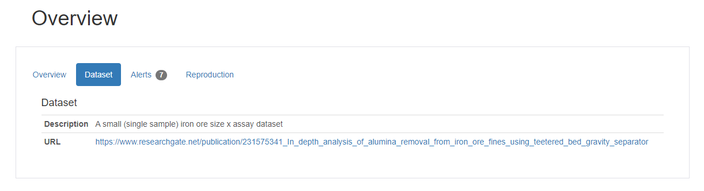

Datasets
========

.. Admonition:: TLDR

   **Datasets** are sourced in the public domain, largely unaltered.

   **Sample Data** is for use in mass-composition examples, often sourced from a dataset with some transformation applied.

*Why two modules?*

We are after open, real data so our examples are realistic.  We are obliged to appropriately reference so the
original *dataset* is largely structured as they are sourced, potentially with some minor adjustments as noted.

The sample_data module contains methods that often load from the dataset module and apply transformations to prepare
data ready for injection into the package.  This keeps examples simple.

This approach retains the integrity of the original datasets, but creates sample_data that simplifies examples.

See the :ref:`sphx_glr_auto_examples_002_data_examples.py` example.

.. _Dataset Register:

Dataset Register
----------------

.. datatemplate:yaml:: table_content.yaml
   :template: table_content.tmpl

|

The description and url of the dataset can be found by clicking the Description button in the Overview section
of the report.

.. toctree::
   :maxdepth: 2
